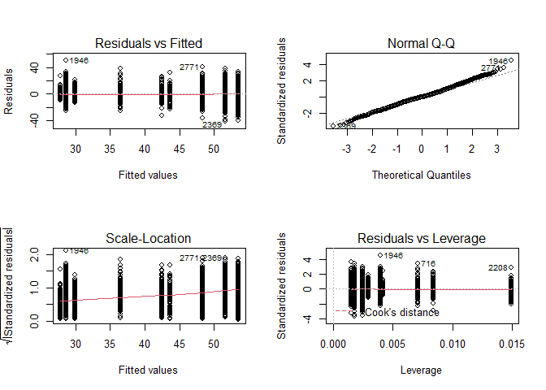

The Relative Importance of Region and Vaccination in Predicting COVID-19
Cases in U.S. Counties
================
Lev El-Askari
9/5/2021

### The Relative Importance of Region and Vaccination in Predicting COVID-19 Cases in U.S. Counties

At the beginning of Summer 2021, the COVID-19 pandemic looked to be
behind us. Cases, hospitalizations, and deaths were at the lowest levels
since the beginning of the pandemic, spurred by what appeared to be a
combination of warm weather and increasing vaccinations. However, the
emergence of the Delta Variant quickly upended this sense of normality.

While cases have risen everywhere, rates have been highest in the
South/Southeast and lowest in the Northeast. This trend corresponds to
the South/Southeast having the lowest vaccination rate of any region,
while the Northeast has the highest. This seems intuitive: higher
vaccination rate, lower case rate.

But what if it wasn’t so simple? Let’s remember that COVID-19 waves
followed regional patterns before vaccines were in widespread use. The
first wave of March 2020 hit the Northeast particularly hard, followed
by a summer wave that primarily affected the South and Sunbelt. There is
speculation about the effect of differing climates, with harsher weather
keeping people indoors where COVID-19 spreads rampantly and mild weather
driving people outdoors where spread is rare. However, for our purposes
here, it doesn’t matter why COVID-19 waves follow regional patterns,
just that they do. So, what is behind the current surge in cases in the
South and Southeast? Is it due to regional patterns, low vaccination
levels, or both? Based on my analysis, I will show that in the United
States, vaccination rates matter, but region also plays a substantial
role in determining case rates.

For this analysis, I will be looking at county-level data. Comparing
vaccination levels and case rates by state gives incomplete information
because vaccination levels vary considerably within states. In general,
highly populated urban areas have much higher vaccination rates than
sparsely populated rural areas. For example, in Wake County, NC, 71% of
those eligible are fully vaccinated, compared to 26% in Stanly County,
NC (a rural county outside of Charlotte). Therefore, one way to examine
the relationship between vaccination rates and COVID-19 case rates while
controlling for regional effects is to use multiple linear regression
(MLR), with region and vaccination levels as predictors. This analysis
has two components:

1.  Visualizing the link between vaccination levels and case rates by
    county within regions of the United States
2.  Building MLR models to determine whether case rates are best
    predicted by region, vaccination levels, or both.

I found that counties with higher vaccination rates had lower case rates
than counties with lower vaccination rates, even when controlling for
region. However, region was a more powerful predictor of case rates,
indicating that we may experience more seasonal waves of COVID-19
regardless of vaccination rates.

### Load packages and data

``` r
library(tidyverse)
library(broom)
library(MASS)

# load county data with rolling averages for cases and hospitalizations from New York Times database
county_case <- read_csv("us-counties.csv") 

# load vaccination data by county from CDC
vax <- read_csv("COVID-19_Vaccinations_in_the_United_States_County.csv") 

# load population data
pop <- read_csv("county_complete.csv")
```

### Clean case data

First, we need to filter for data between July 7, 2021 and September 5,
2021. This captures the Delta-variant wave that we are examining. Then
we get the fips code from the geoID (it’s just the numbers in the code).
This is what we will use to merge the data with the vaccination data by
county and the population data by county.

``` r
county_case<- county_case %>% 
  filter(date >= as.Date("2021-07-06") & date <= as.Date("2021-09-5")) %>% 
  mutate(fips = as.numeric(substr(geoid, 5, 9))) %>% 
  dplyr::select(county, state, cases, fips)
```

### Create aggregated county data

Now, we aggregate the cases for each county in each state during the
Delta surge. This will give us one row per county.

``` r
counties_agg <- county_case %>% 
  group_by(fips) %>% 
  dplyr::summarise(
            county = unique(county),
            state = unique(state),
            cases = sum(cases))
```

### Join population data set to cases data set to get case rate per 100,000 people

``` r
# select just fips code and population
pop <- pop %>% 
  dplyr::select(fips, pop2017)

# join data and create case_rate, which is the rate per 100,000 people
counties_agg <- counties_agg %>% 
  inner_join(pop, by = "fips") %>% 
  mutate(case_rate = (cases/pop2017) * 100000)
```

### Clean vaccination data

Clean fips variable for merging and remove NAs. We filter for 7/06/2021
because this is when the 7-day average for cases began rising in the US
due to the Delta variant. Therefore, the vaccination rate from that date
is a good indicator of how much protection counties would have against
the Delta surge. Note that the vaccination rate refers to the percent
fully vaccinated (2 weeks after final dose).

``` r
vax <- vax %>% 
  dplyr::rename(fully_vax = Series_Complete_Pop_Pct,
         fips = FIPS)%>% 
  filter(Date == "07/06/2021" & !(is.na(fips))) %>% 
  mutate(fips = as.numeric(fips)) %>% 
  dplyr::select(fips, fully_vax)
```

### Join the vaccination and case rate data

``` r
# inner join to only include counties that have a case rate and a vaccination rate
vax_case <- vax %>% 
  inner_join(counties_agg, by = "fips")
```

### How does the percent fully vaccinated relate to case rate per 100,000?

We exclude counties that report 0% or 100% vaccinated because this is
impossible since children under 12 are not yet eligible. We also exclude
counties where the case rate is 0 over the last 7 days as these won’t be
useful in our analysis and is likely due to a lack of reporting.

``` r
# exclude counties with suspicious numbers
vax_case <- vax_case %>% 
  filter(fully_vax > 0 & fully_vax < 99 &  case_rate > 0) 

# plot vaccination rate and case rate
vax_case %>% 
  ggplot(aes(x = fully_vax, y = case_rate))+
  geom_point()+
  geom_smooth(method = "lm")+
  labs(title = "Vaccination Levels and Case Rates in the United States", x = "Percent Fully Vaccinated", y = "Case Rate per 100,000")+
  theme_classic()+
  theme(plot.title = element_text(hjust = 0.5))
```

<!-- -->

##### There appears to be a negative relationship between vaccination rate and case rate

We can run a correlation test to test for significance and the strength
of the relationship

``` r
# get alpha level based on sample size
a = 1-pchisq(log(nrow(vax_case)),1)
a
```

    ## [1] 0.004829076

``` r
# use alpha level of 0.0048 for remainder of analysis

# correlation test
cor.test(vax_case$fully_vax, vax_case$case_rate)
```

    ## 
    ##  Pearson's product-moment correlation
    ## 
    ## data:  vax_case$fully_vax and vax_case$case_rate
    ## t = -18.847, df = 2812, p-value < 2.2e-16
    ## alternative hypothesis: true correlation is not equal to 0
    ## 95 percent confidence interval:
    ##  -0.3672946 -0.3016716
    ## sample estimates:
    ##        cor 
    ## -0.3348891

There is a significant negative correlation between vaccination rate and
case rate. The correlation is -0.335.

### So, counties with higher vaccination rates have fewer cases

##### However, could there be a third variable at play here?

The most vaccinated states are mostly in the Northeast, where the
weather is milder this time of year. The least vaccinated states are
mostly in the South, where the it extremely hot, pushing people indoors.
Last summer, before vaccines were available, we saw this pattern of
cases rising in the southern US and remaining lower in the northern US.
Could it be that the climate and seasons are driving the cases up in the
South which happens to have many counties with low rates of vaccination?

### Let’s look at counties within climate regions in the United States to control for seasonal effects

##### Create regions by climate

COVID-19 waves have been observed to follow seasonal patterns related to
climate. We can create regions based on climate using the National
Centers for Environmental Information(source:
<https://www.ncdc.noaa.gov/monitoring-references/maps/us-climate-regions.php>).
Alaska and Hawaii are excluded since they don’t fit into the climate
zones of the US.

``` r
vax_case <- vax_case %>% 
  mutate(region = case_when(state %in% c("Connecticut","Maine","Massachusetts","New Hampshire",
             "Rhode Island","Vermont","New Jersey","New York",
             "Pennsylvania", "Delaware", "Maryland" ) ~ "Northeast",
             state %in% c("Alabama", "Florida", "Georgia", "North Carolina", "South Carolina", "Virginia") ~ "Southeast",
             state %in% c("Illinois", "Indiana", "Kentucky", "Missouri", "Ohio", "Tennessee", "West Virginia") ~ "Ohio Valley",
             state %in% c("Iowa", "Michigan", "Minnesota", "Wisconsin") ~ "Upper Midwest",
             state %in% c("Idaho", "Oregon", "Washington") ~ "Northwest",
             state %in% c("Arkansas", "Kansas", "Louisiana", "Mississippi", "Oklahoma", "Texas") ~ "South",
             state %in% c("Arizona", "Colorado", "New Mexico", "Utah") ~ "Southwest",
             state %in% c("California", "Nevada") ~ "West",
             state %in% c("Montana", "Nebraska", "North Dakota", "South Dakota", "Wyoming") ~ "North Rockies/Plains"))
```

### Let’s look at the relationship between vaccination rate and case rate for each climate region

##### Northeast

``` r
vax_case %>% 
  filter(region == "Northeast") %>% 
  ggplot(aes(x = fully_vax, y = case_rate))+
  geom_point()+
  geom_smooth(method = "lm")+
  labs(title = "Vaccination Levels and Case Rates in the Northeast", x = "Percent Fully Vaccinated", y = "Case Rate per 100,000")+
  theme_classic()+
  theme(plot.title = element_text(hjust = 0.5))
```

<!-- -->

##### Southeast

``` r
vax_case %>% 
  filter(region == "Southeast") %>% 
  ggplot(aes(x = fully_vax, y = case_rate))+
  geom_point()+
  geom_smooth(method = "lm")+
  labs(title = "Vaccination Levels and Case Rates in the Southeast",x = "Percent Fully Vaccinated", y = "Case Rate per 100,000")+
  theme_classic()+
  theme(plot.title = element_text(hjust = 0.5))
```

<!-- -->

##### West

``` r
vax_case %>% 
  filter(region == "West") %>% 
  ggplot(aes(x = fully_vax, y = case_rate))+
  geom_point()+
  geom_smooth(method = "lm")+
  labs(title = "Vaccination Levels and Case Rates in the West",x = "Percent Fully Vaccinated", y = "Case Rate per 100,000")+
  theme_classic()+
  theme(plot.title = element_text(hjust = 0.5))
```

<!-- -->

##### Southwest

``` r
vax_case %>% 
  filter(region == "Southwest") %>%
  ggplot(aes(x = fully_vax, y = case_rate))+
  geom_point()+
  geom_smooth(method = "lm")+
  labs(title = "Vaccination Levels and Case Rates in the Southwest",x = "Percent Fully Vaccinated", y = "Case Rate per 100,000")+
  theme_classic()+
  theme(plot.title = element_text(hjust = 0.5))
```

<!-- -->

##### Upper Midwest

``` r
vax_case %>% 
  filter(region == "Upper Midwest") %>% 
  ggplot(aes(x = fully_vax, y = case_rate))+
  geom_point()+
  geom_smooth(method = "lm")+
  labs(title = "Vaccination Levels and Case Rates in the Upper Midwest",x = "Percent Fully Vaccinated", y = "Case Rate per 100,000")+
  theme_classic()+
  theme(plot.title = element_text(hjust = 0.5))
```

<!-- -->

## South

``` r
vax_case %>% 
  filter(region == "South") %>% 
  ggplot(aes(x = fully_vax, y = case_rate))+
  geom_point()+
  geom_smooth(method = "lm")+
  labs(title = "Vaccination Levels and Case Rates in the South",x = "Percent Fully Vaccinated", y = "Case Rate per 100,000")+
  theme_classic()+
  theme(plot.title = element_text(hjust = 0.5))
```

<!-- -->

##### Ohio Valley

``` r
vax_case %>% 
  filter(region == "Ohio Valley") %>% 
  ggplot(aes(x = fully_vax, y = case_rate))+
  geom_point()+
  geom_smooth(method = "lm")+
  labs(title = "Vaccination Levels and Case Rates in the Ohio Valley",x = "Percent Fully Vaccinated", y = "Case Rate per 100,000")+
  theme_classic()+
  theme(plot.title = element_text(hjust = 0.5))
```

<!-- -->

##### Northwest

``` r
vax_case %>% 
  filter(region == "Northwest") %>% 
  ggplot(aes(x = fully_vax, y = case_rate))+
  geom_point()+
  geom_smooth(method = "lm")+
  labs(title = "Vaccination Levels and Case Rates in the Northwest",x = "Percent Fully Vaccinated", y = "Case Rate per 100,000")+
  theme_classic()+
  theme(plot.title = element_text(hjust = 0.5))
```

<!-- -->

##### Northern Rockies and Plains

``` r
vax_case %>% 
  filter(region == "North Rockies/Plains") %>% 
  ggplot(aes(x = fully_vax, y = case_rate))+
  geom_point()+
  geom_smooth(method = "lm")+
  labs(title = "Vaccination Levels and Case Rates in the Northern Rockies and Plains",x = "Percent Fully Vaccinated", y = "Case Rate per 100,000")+
  theme_classic()+
  theme(plot.title = element_text(hjust = 0.5))
```

<!-- -->

### Let’s examine a bar chart of the correlations for each region

``` r
# create table with the correlation between case rate and vaccination rate in each region
cor_case_region <- vax_case %>% 
  group_by(region) %>% 
  dplyr::summarise(correlation = cor(fully_vax, case_rate))

# plot the correlation for each region
cor_case_region %>%
  filter(!is.na(region)) %>% 
  mutate(region = fct_reorder(region, correlation), .fun='mean') %>% 
  ggplot(aes(x = region, y = correlation))+
  geom_col(fill = "#4472C4")+
  theme_classic()+
  theme(axis.text.x = element_text(angle = 90, vjust = 0.5, hjust=1))+
  labs(x = "Region", y = "Correlation", title = "Correlation Between Vaccination Level and COVID-19 Case Rate by Region")+
  ylim(c(-0.4, 0.2))
```

<!-- -->

### Are any of these correlations significant?

``` r
# create table of significance levels for each region
vax_case %>% 
  nest(-region) %>% 
  mutate(cor=map(data,~cor.test(.x$fully_vax, .x$case_rate))) %>%
  mutate(tidied = map(cor, tidy)) %>% 
  unnest(tidied, .drop = T) %>% 
  dplyr::select(region, estimate, p.value) %>% 
  filter(!is.na(region)) %>% 
  mutate(estimate = round(estimate, 3),
         p.value = round(p.value, 5)) %>% 
  arrange(p.value)
```

    ## # A tibble: 9 x 3
    ##   region               estimate p.value
    ##   <chr>                   <dbl>   <dbl>
    ## 1 South                  -0.322 0      
    ## 2 Ohio Valley            -0.233 0      
    ## 3 Northeast              -0.276 0.00002
    ## 4 West                   -0.23  0.0613 
    ## 5 Southeast               0.063 0.134  
    ## 6 Upper Midwest          -0.036 0.505  
    ## 7 Southwest              -0.053 0.536  
    ## 8 North Rockies/Plains   -0.036 0.564  
    ## 9 Northwest              -0.03  0.746

Three out of the nine regions had a significant negative relationship
between case rate rates and vaccination rates. No regions had a positive
relationship. This indicates a general trend, where higher vaccination
rate is associated with higher case rate. However, this effect is not as
strong as indicated by the graph of the entire US. Maybe region is
playing a large role here. Let’s examine to see if this is the case.

### Case rate by region of the US

``` r
# plot the case rate for each region
vax_case %>% 
  group_by(region) %>% 
  summarise(case_rate = mean(case_rate)) %>% 
  filter(!(is.na(region))) %>% 
  mutate(region = fct_reorder(region, desc(case_rate)), .fun='mean') %>%
  ggplot(aes(x = region, y = case_rate))+
  geom_col(fill = "orange2")+
  theme_classic()+
  theme(axis.text.x = element_text(angle = 90, vjust = 0.5, hjust=1))+
  labs(title = "Case Rate per Region", x = "Region", y = "Case Rate (per 100,000)")+
  theme(plot.title = element_text(hjust = 0.5))
```

<!-- -->

From this plot, you can see that case rate varies widely by region. Now,
we need to parse out whether it is the region itself or the differing
vaccination rates by region that is driving this relationship.

Now let’s build some regression models to determine whether case rate is
best predicted by region, vaccination rate, or a combination of the two.

### Region predicting case rate

``` r
case1 <- lm(vax_case$case_rate ~ vax_case$region)
summary(case1)
```

    ## 
    ## Call:
    ## lm(formula = vax_case$case_rate ~ vax_case$region)
    ## 
    ## Residuals:
    ##     Min      1Q  Median      3Q     Max 
    ## -2861.6  -629.9   -99.6   488.5  5410.9 
    ## 
    ## Coefficients:
    ##                              Estimate Std. Error t value Pr(>|t|)    
    ## (Intercept)                    982.28      68.41  14.359  < 2e-16 ***
    ## vax_case$regionNortheast      -191.09      98.15  -1.947   0.0516 .  
    ## vax_case$regionNorthwest       931.11     120.95   7.698 1.90e-14 ***
    ## vax_case$regionOhio Valley    1463.03      80.34  18.210  < 2e-16 ***
    ## vax_case$regionSouth          2080.49      87.36  23.815  < 2e-16 ***
    ## vax_case$regionSoutheast      1872.30      82.36  22.734  < 2e-16 ***
    ## vax_case$regionSouthwest       446.30     114.35   3.903 9.73e-05 ***
    ## vax_case$regionUpper Midwest   -60.88      90.29  -0.674   0.5002    
    ## vax_case$regionWest           1014.72     149.50   6.787 1.39e-11 ***
    ## ---
    ## Signif. codes:  0 '***' 0.001 '**' 0.01 '*' 0.05 '.' 0.1 ' ' 1
    ## 
    ## Residual standard error: 1088 on 2782 degrees of freedom
    ##   (23 observations deleted due to missingness)
    ## Multiple R-squared:  0.3821, Adjusted R-squared:  0.3804 
    ## F-statistic: 215.1 on 8 and 2782 DF,  p-value: < 2.2e-16

Here you can see that region is a significant predictor of case rate.
Let’s check the assumptions for simple linear regression before
proceeding.

##### Check assumptions

``` r
# Examine assumptions
par(mfrow=c(2,2))
plot(case1)
```

<!-- -->

From the residual vs. fitted plot and Q-Q plot, it appears that the
assumptions for equal variance and normality aren’t holding. Let’s try a
Box-Cox transformation to see if we can address this.

##### Box-Cox Transformation

``` r
boxcox(case1)
```

<!-- -->

This indicates that a square root transformation may be helpful. Let’s
try it.

### Region predicting case rate with a square root transformation

``` r
case1sqrt <- lm(sqrt(vax_case$case_rate) ~ vax_case$region)
summary(case1sqrt)
```

    ## 
    ## Call:
    ## lm(formula = sqrt(vax_case$case_rate) ~ vax_case$region)
    ## 
    ## Residuals:
    ##     Min      1Q  Median      3Q     Max 
    ## -40.498  -6.736  -0.279   6.559  50.014 
    ## 
    ## Coefficients:
    ##                              Estimate Std. Error t value Pr(>|t|)    
    ## (Intercept)                   28.5701     0.7065  40.437  < 2e-16 ***
    ## vax_case$regionNortheast      -0.8099     1.0137  -0.799    0.424    
    ## vax_case$regionNorthwest      13.9389     1.2492  11.158  < 2e-16 ***
    ## vax_case$regionOhio Valley    19.6941     0.8298  23.734  < 2e-16 ***
    ## vax_case$regionSouth          24.9367     0.9023  27.637  < 2e-16 ***
    ## vax_case$regionSoutheast      23.0857     0.8506  27.141  < 2e-16 ***
    ## vax_case$regionSouthwest       7.9124     1.1811   6.699 2.52e-11 ***
    ## vax_case$regionUpper Midwest   1.3271     0.9325   1.423    0.155    
    ## vax_case$regionWest           15.0455     1.5441   9.744  < 2e-16 ***
    ## ---
    ## Signif. codes:  0 '***' 0.001 '**' 0.01 '*' 0.05 '.' 0.1 ' ' 1
    ## 
    ## Residual standard error: 11.24 on 2782 degrees of freedom
    ##   (23 observations deleted due to missingness)
    ## Multiple R-squared:  0.4415, Adjusted R-squared:  0.4399 
    ## F-statistic: 274.9 on 8 and 2782 DF,  p-value: < 2.2e-16

This improved our adjusted R^2 from 0.38 to 0.44. Let’s see if it helped
meet the assumptions

##### Check assumptions

``` r
# Examine assumptions
par(mfrow=c(2,2))
plot(case1sqrt)
```

<!-- -->

The square root transformation of case rate improved the model and
fulfilled the assumptions. Great\! Now, let’s look at vaccination rate
predicting case rate.

### Vaccination rate predicting case rate

``` r
case2 <- lm(vax_case$case_rate~ vax_case$fully_vax)
summary(case2)
```

    ## 
    ## Call:
    ## lm(formula = vax_case$case_rate ~ vax_case$fully_vax)
    ## 
    ## Residuals:
    ##     Min      1Q  Median      3Q     Max 
    ## -3152.1  -909.4  -269.6   719.7  5985.2 
    ## 
    ## Coefficients:
    ##                    Estimate Std. Error t value Pr(>|t|)    
    ## (Intercept)        3355.445     72.105   46.54   <2e-16 ***
    ## vax_case$fully_vax  -36.920      1.959  -18.85   <2e-16 ***
    ## ---
    ## Signif. codes:  0 '***' 0.001 '**' 0.01 '*' 0.05 '.' 0.1 ' ' 1
    ## 
    ## Residual standard error: 1305 on 2812 degrees of freedom
    ## Multiple R-squared:  0.1122, Adjusted R-squared:  0.1118 
    ## F-statistic: 355.2 on 1 and 2812 DF,  p-value: < 2.2e-16

##### Check assumptions

``` r
# Examine assumptions
par(mfrow=c(2,2))
plot(case2)
```

<!-- -->
Here, we are seeing a fan-shaped Residual vs. Fitted plot and some
issues with the Q-Q plot. Let’s try a Box-Cox transformation

##### Box-Cox Transformation

``` r
boxcox(case2)
```

<!-- -->

This indicates that a square root transformation may be helpful. Let’s
try it.

### Vaccination rate predicting case rate with a square root transformation

``` r
case2sqrt <- lm(sqrt(vax_case$case_rate) ~ vax_case$fully_vax)
summary(case2sqrt)
```

    ## 
    ## Call:
    ## lm(formula = sqrt(vax_case$case_rate) ~ vax_case$fully_vax)
    ## 
    ## Residuals:
    ##     Min      1Q  Median      3Q     Max 
    ## -43.990  -9.939  -0.978   9.759  52.071 
    ## 
    ## Coefficients:
    ##                    Estimate Std. Error t value Pr(>|t|)    
    ## (Intercept)         57.1969     0.7802   73.31   <2e-16 ***
    ## vax_case$fully_vax  -0.4092     0.0212  -19.30   <2e-16 ***
    ## ---
    ## Signif. codes:  0 '***' 0.001 '**' 0.01 '*' 0.05 '.' 0.1 ' ' 1
    ## 
    ## Residual standard error: 14.12 on 2812 degrees of freedom
    ## Multiple R-squared:  0.117,  Adjusted R-squared:  0.1167 
    ## F-statistic: 372.7 on 1 and 2812 DF,  p-value: < 2.2e-16

This improved our adjusted R^2 from 0.11 to 0.12. Let’s see if it helped
meet the assumptions

``` r
# Examine assumptions
par(mfrow=c(2,2))
plot(case2sqrt)
```

<!-- -->

The square root transformation of case rate improved the model and
fulfilled the assumptions.

Now, let’s build a model with both region and vaccination rate. This
will allow us to see if vaccination rate explains any additional
variance in case rates beyond that which is explained by region

### Vaccination rate and region predicting case rate

``` r
case3 <- lm(vax_case$case_rate ~ vax_case$fully_vax + vax_case$region)
summary(case3)
```

    ## 
    ## Call:
    ## lm(formula = vax_case$case_rate ~ vax_case$fully_vax + vax_case$region)
    ## 
    ## Residuals:
    ##     Min      1Q  Median      3Q     Max 
    ## -2904.3  -628.7   -88.9   474.3  5374.1 
    ## 
    ## Coefficients:
    ##                              Estimate Std. Error t value Pr(>|t|)    
    ## (Intercept)                  1284.392     96.399  13.324  < 2e-16 ***
    ## vax_case$fully_vax             -8.939      2.016  -4.433 9.65e-06 ***
    ## vax_case$regionNortheast      -55.084    102.520  -0.537    0.591    
    ## vax_case$regionNorthwest      990.579    121.289   8.167 4.74e-16 ***
    ## vax_case$regionOhio Valley   1456.075     80.088  18.181  < 2e-16 ***
    ## vax_case$regionSouth         2056.690     87.235  23.576  < 2e-16 ***
    ## vax_case$regionSoutheast     1792.525     84.031  21.332  < 2e-16 ***
    ## vax_case$regionSouthwest      450.679    113.974   3.954 7.87e-05 ***
    ## vax_case$regionUpper Midwest   31.215     92.352   0.338    0.735    
    ## vax_case$regionWest          1089.129    149.944   7.264 4.87e-13 ***
    ## ---
    ## Signif. codes:  0 '***' 0.001 '**' 0.01 '*' 0.05 '.' 0.1 ' ' 1
    ## 
    ## Residual standard error: 1084 on 2781 degrees of freedom
    ##   (23 observations deleted due to missingness)
    ## Multiple R-squared:  0.3865, Adjusted R-squared:  0.3845 
    ## F-statistic: 194.6 on 9 and 2781 DF,  p-value: < 2.2e-16

##### Check assumptions

``` r
# Examine assumptions
par(mfrow=c(2,2))
plot(case3)
```

<!-- -->

Equal variance and normality are not being met. Let’s try a Box-Cox
Transformation

``` r
boxcox(case3)
```

<!-- -->
This indicates that a square root transformation might be helpful.

### Region and vaccination rate predicting case rate with a square root transformation

``` r
case3sqrt <- lm(sqrt(vax_case$case_rate) ~ vax_case$region + vax_case$fully_vax)
summary(case3sqrt)
```

    ## 
    ## Call:
    ## lm(formula = sqrt(vax_case$case_rate) ~ vax_case$region + vax_case$fully_vax)
    ## 
    ## Residuals:
    ##     Min      1Q  Median      3Q     Max 
    ## -42.154  -6.672  -0.223   6.460  50.224 
    ## 
    ## Coefficients:
    ##                              Estimate Std. Error t value Pr(>|t|)    
    ## (Intercept)                  31.52090    0.99601  31.647  < 2e-16 ***
    ## vax_case$regionNortheast      0.51844    1.05925   0.489   0.6246    
    ## vax_case$regionNorthwest     14.51972    1.25318  11.586  < 2e-16 ***
    ## vax_case$regionOhio Valley   19.62614    0.82748  23.718  < 2e-16 ***
    ## vax_case$regionSouth         24.70424    0.90133  27.409  < 2e-16 ***
    ## vax_case$regionSoutheast     22.30650    0.86822  25.692  < 2e-16 ***
    ## vax_case$regionSouthwest      7.95510    1.17760   6.755 1.73e-11 ***
    ## vax_case$regionUpper Midwest  2.22663    0.95419   2.334   0.0197 *  
    ## vax_case$regionWest          15.77236    1.54924  10.181  < 2e-16 ***
    ## vax_case$fully_vax           -0.08731    0.02083  -4.191 2.87e-05 ***
    ## ---
    ## Signif. codes:  0 '***' 0.001 '**' 0.01 '*' 0.05 '.' 0.1 ' ' 1
    ## 
    ## Residual standard error: 11.2 on 2781 degrees of freedom
    ##   (23 observations deleted due to missingness)
    ## Multiple R-squared:  0.445,  Adjusted R-squared:  0.4432 
    ## F-statistic: 247.7 on 9 and 2781 DF,  p-value: < 2.2e-16

This improved our adjusted R^2 from 0.38 to 0.44. Let’s see if it helped
meet the assumptions

``` r
# Examine assumptions
par(mfrow=c(2,2))
plot(case3sqrt)
```

<!-- -->

The square root transformation of case rate improved the model and
fulfilled the assumptions.

Now we want to look at the relative importance of region and vaccination
rate in predicting case rate. To do this, we can examine how the R^2
changes for each model when we add the other variable. This change in R2
represents the additional variance in case rates explained by adding the
other variable.

# Change in R^2

``` r
print(paste("Change in R^2 of Region to Region + Vaccination:", summary(case3sqrt)$r.squared - summary(case1sqrt)$r.squared))
```

    ## [1] "Change in R^2 of Region to Region + Vaccination: 0.00350492297213223"

``` r
print(paste("Change in R^2 of Vaccination to Vaccination + Region:", summary(case3sqrt)$r.squared - summary(case2sqrt)$r.squared))
```

    ## [1] "Change in R^2 of Vaccination to Vaccination + Region: 0.327950684824514"

When adding vaccination to a region-only model, there was a change in
R^2 of 0.0035 (0.35% additional explained variance). When adding region
to a vaccination-only model, there was a change in R^2 of 0.3280 (32.80%
additional explained variance).

# Takeaways

This analysis presents two clear findings:

1.  Counties with higher vaccinations had lower case rates, even when
    controlling for region
2.  Region was better than vaccination levels at predicting case rates

This has several important implications. First, increasing vaccinations
may help reduce the spread of COVID-19. Vaccinations should be
encouraged for this reason, in addition to their demonstrated effects of
reducing severe disease, hospitalization, and death on an individual
level. Additionally, there may be under-looked regional effects that
drive surges in COVID-19 cases, meaning that COVID-19 is unlikely to be
eradicated due to increased vaccination. Instead, it could become
endemic, continuing to have regional surges in the coming years. We may
need to begin to think of vaccinations as our ticket to living with
COVID-19 rather than without it.
